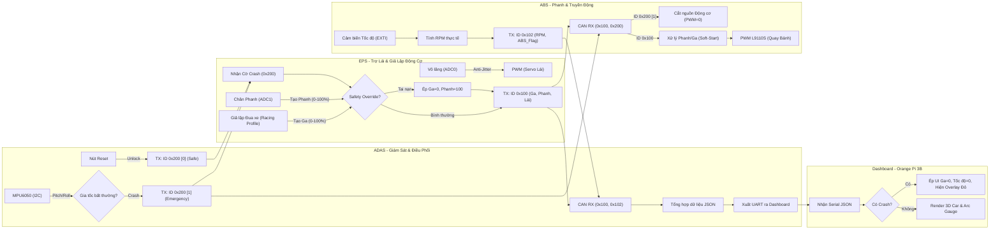
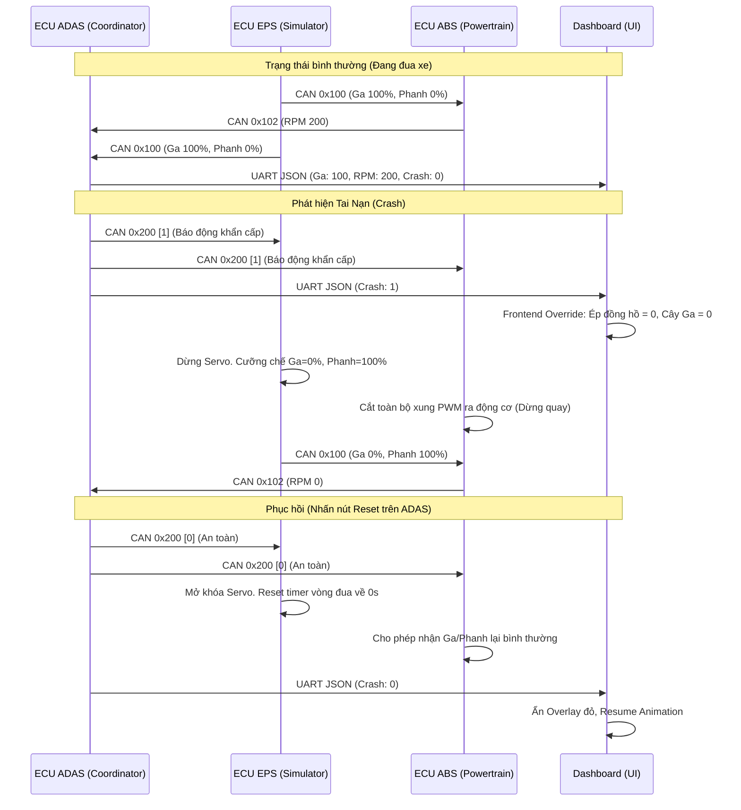

# Sơ đồ Kiến Trúc & Luồng Giao Tiếp (Flowchart) Hệ thống 3 Node ECU

Dưới đây là sơ đồ luồng và sơ đồ tuần tự chi tiết mô tả cách các ECU (ADAS, EPS, ABS) tương tác với nhau qua mạng CAN Bus và giao tiếp với màn hình IVI Dashboard trong kiến trúc mới nhất.

## 1. Kiến Trúc Tổng Thể & Giao Tiếp CAN (Flowchart)

## 2. Sơ Đồ Tuần Tự Xử Lý Khẩn Cấp (Crash Sequence Diagram)

