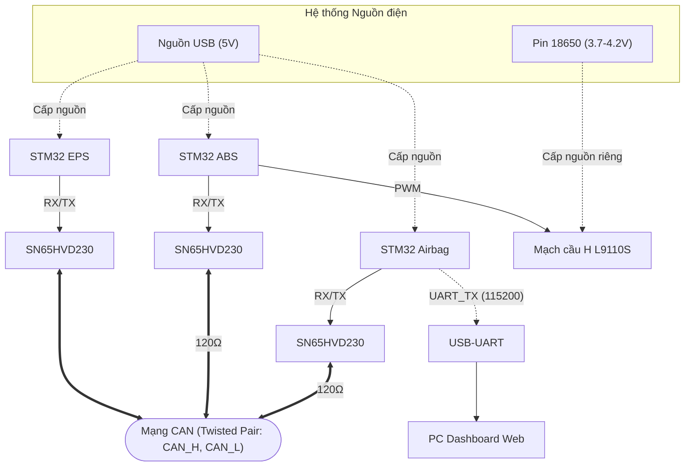
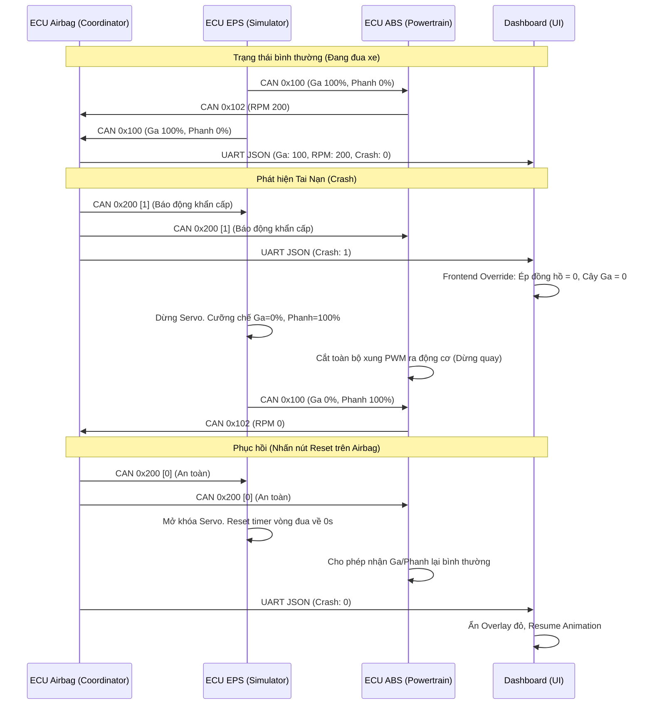
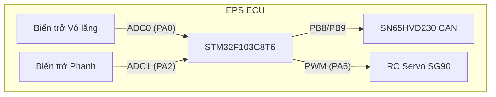
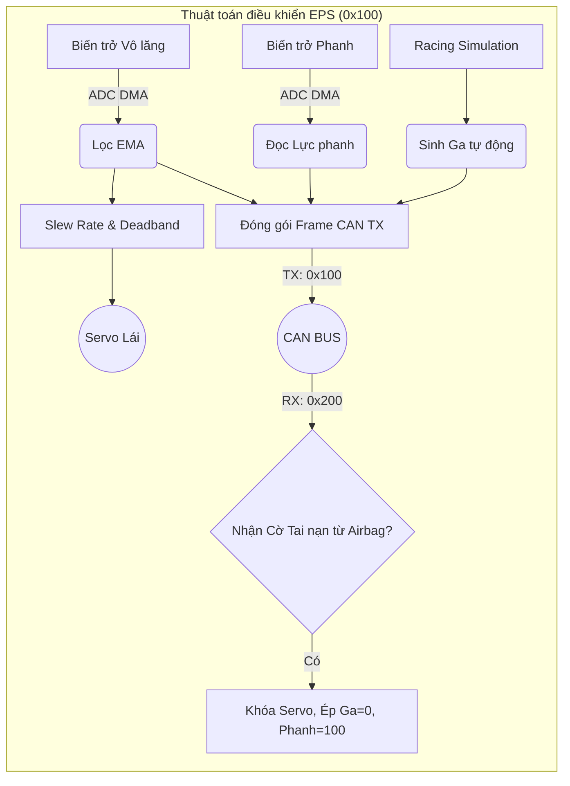
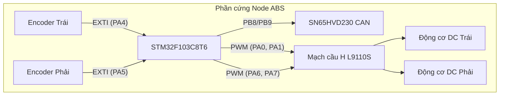
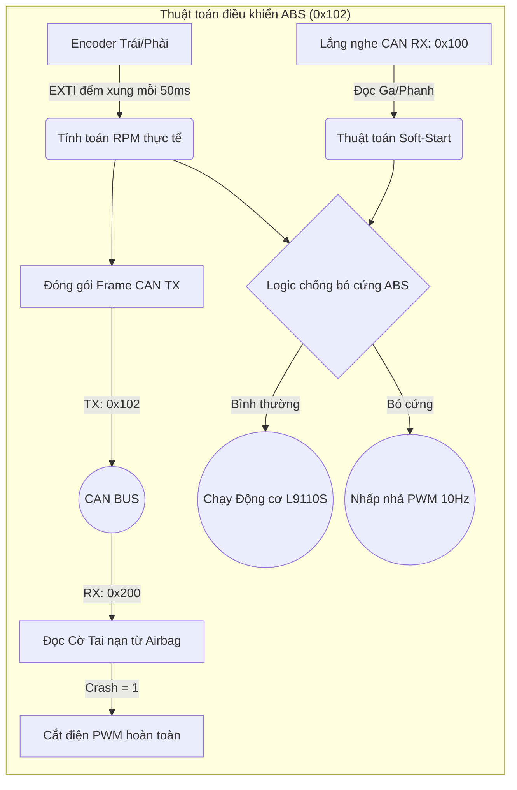
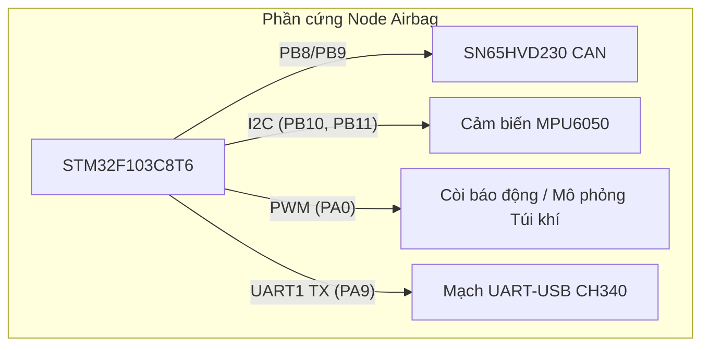
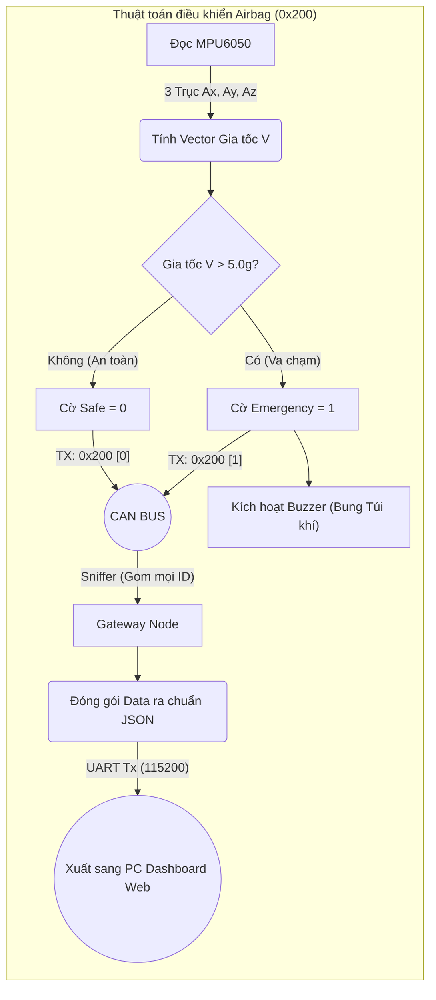

# TÀI LIỆU TỔNG HỢP ĐỒ ÁN — Hệ Thống Mạng CAN 3 Node ECU & IVI Dashboard (Bản Tích Hợp Đầy Đủ)

---

## Mục lục
1. TỔNG QUAN VỀ HỆ THỐNG
2. CƠ SỞ LÝ THUYẾT
3. THIẾT KẾ VÀ TRIỂN KHAI HỆ THỐNG
4. KIỂM THỬ, VẬN HÀNH VÀ GỠ LỖI
5. KẾT LUẬN VÀ HƯỚNG PHÁT TRIỂN
6. PHỤ LỤC: LỆNH GỠ LỖI & BUILD

---

## 1. TỔNG QUAN VỀ HỆ THỐNG

### 1.1. Giới thiệu tổng quan đề tài
Đồ án thiết kế và mô phỏng một mạng lưới giao tiếp trên ô tô (In-Vehicle Network) thu nhỏ, áp dụng tiêu chuẩn công nghiệp **CAN Bus (Controller Area Network)**. 
Hệ thống bao gồm 3 Node ECU độc lập (EPS, ABS, Airbag/Airbag) giao tiếp theo thời gian thực và 1 Màn hình giải trí trung tâm (IVI Dashboard) bằng công nghệ Web 3D.

### 1.2. Nhiệm vụ và Yêu cầu đồ án
- Thiết kế phần cứng và nối mạng CAN giữa 3 vi điều khiển STM32.
- Lập trình thuật toán mô phỏng Trợ lực lái (EPS), Phanh (ABS) và Cảnh báo va chạm / Hỗ trợ lái (Airbag/Airbag).
- Xây dựng phần mềm Dashboard nhận dữ liệu qua UART và hiển thị đồ họa 3D Telemetry.
- Đảm bảo tính chịu lỗi (Fault Tolerance) của toàn bộ hệ thống ở mức cao nhất thông qua CAN Safety Protocol.

### 1.3. Sơ đồ giao tiếp mạng cơ bản
- **Giao thức lõi:** CAN Bus 2.0A (Standard ID 11-bit), Tốc độ 500Kbps.
- **Giao tiếp HMI:** Node Airbag tổng hợp dữ liệu từ CAN Bus, đóng gói thành chuỗi JSON và truyền qua UART (Web Serial API) lên Dashboard.

---

## 2. CƠ SỞ LÝ THUYẾT

### 2.1. Vi điều khiển STM32F103C8T6
- Nền tảng lõi ARM Cortex-M3 (72MHz).
- Tích hợp sẵn bộ điều khiển bxCAN hỗ trợ CAN 2.0A/B.
- Các ngoại vi sử dụng cốt lõi: DMA, ADC, I2C, UART, TIM (PWM), EXTI.

### 2.2. Giao thức mạng CAN (Controller Area Network)
> **💡 Bản chất cốt lõi của mạng CAN:** 
> 1. **ID định danh cho "Bản tin", không phải cho "Node":** Mạng CAN không có địa chỉ Node. CAN ID (ví dụ `0x100`) chỉ định danh cho nội dung *"Dữ liệu Vô lăng & Phanh"*. 
> 2. **Mạng Phát thanh (Broadcast) & Bộ lọc Phần cứng:** Bất kỳ tín hiệu nào phát ra, toàn bộ đường dây đều "nghe" thấy. Vi điều khiển dùng phần cứng để lọc ID cần thiết.

**Cấu trúc Khung truyền cơ bản (CAN 2.0A):**
| Start | ARBITRATION FIELD | CONTROL FIELD | DATA FIELD | CRC FIELD | ACK FIELD | EOF |
| :---: | :---: | :---: | :---: | :---: | :---: | :---: |
| **SOF** | **ID** (11) \| **RTR** (1) | **IDE** \| **r0** \| **DLC** (4) | **Payload** (0-64) | **CRC** (15) \| **DEL** | **ACK** \| **DEL** | **End** (7) |

### 2.3. Cảm biến gia tốc MPU6050
- Cảm biến IMU 6 trục giao tiếp qua bus I2C.
- Trích xuất 3 trục X, Y, Z để tổng hợp Vector gia tốc trọng trường $V = \sqrt{A_x^2 + A_y^2 + A_z^2}$.
- Kích hoạt hệ thống an toàn thụ động (Airbag / SRS).

### 2.4. Trợ lực lái điện (EPS) và Chống bó cứng phanh (ABS)
- **EPS:** Đọc góc lái vô lăng và điều khiển Motor trợ lực. Mô phỏng bằng Servo và biến trở ADC.
- **ABS:** Ngăn bánh xe khóa chết khi phanh gấp. Thực thi bằng nhấp nhả phanh liên tục (10-15 lần/giây).

---

## 3. THIẾT KẾ VÀ TRIỂN KHAI HỆ THỐNG

### 3.1. Thiết kế phần cứng & Giao tiếp vật lý
- **Hệ thống Nguồn điện (Power Supply):** 
  - Toàn bộ khối điều khiển (3 mạch STM32, các module cảm biến, IC SN65HVD230, mô-tơ Servo) đều được cấp nguồn **5V qua cổng USB**.
  - Riêng Driver điều khiển 2 động cơ DC (Mạch cầu H L9110S tại Node ABS) được cấp nguồn độc lập từ **1 viên pin Li-ion 18650 (3.7V - 4.2V)** để đảm bảo dòng xả tĩnh lớn tải được động cơ, đồng thời ngăn hiện tượng sụt điện áp (brown-out) làm reset vi điều khiển trên mạng CAN.
- **CAN Transceiver:** 3 module **SN65HVD230** (3.3V logic).
- **Điện trở đầu cuối:** 2 điện trở **120Ω** ở 2 đầu mạng.
- Cả ba ECU bật `AutoBusOff`. CAN SCE interrupt và `HAL_CAN_ErrorCallback()` ghi nhận lỗi Error Warning, Error Passive, Last Error Code và Bus-Off.
- **Cơ cấu chấp hành:** Mạch cầu H L9110S (ABS), Servo SG90 (EPS).

**Sơ đồ đấu nối mạng tổng quát:**


> **📌 Chú thích các loại đường dẫn trong sơ đồ:**
> - **Nét liền (Solid line):** Thể hiện các đường truyền tín hiệu dữ liệu và điều khiển vật lý cốt lõi (Mạng CAN, PWM, giao tiếp RX/TX giữa MCU và Transceiver).
> - **Nét đứt (Dashed line):** Thể hiện các đường cấp nguồn điện (5V, Pin) hoặc đường phụ trợ truyền dữ liệu Telemetry hiển thị lên PC (UART).

**Bảng sơ đồ chân (Pinout) chi tiết cho từng Node ECU:**
| Node ECU | Ngoại vi / Linh kiện | Chân STM32 | Chức năng |
| :--- | :--- | :--- | :--- |
| **Node EPS** | SN65HVD230 (CAN) | `PB8` (RX) / `PB9` (TX) | Giao tiếp mạng CAN |
| | Biến trở (ADC) | `PA0`, `PA2` | Đọc góc Vô lăng và lực Phanh |
| | Động cơ RC Servo | `PA3`, `PA6` | Băm xung PWM điều khiển góc lái |
| **Node ABS** | SN65HVD230 (CAN) | `PB8` (RX) / `PB9` (TX) | Giao tiếp mạng CAN |
| | Mạch cầu H L9110S | `PA0`, `PA1`, `PA6`, `PA7` | Băm xung PWM truyền động 2 Motor |
| | Cảm biến Tốc độ | `PA4`, `PA5` | Ngắt ngoài (EXTI) đếm quang trở Encoder |
| **Node Airbag** | SN65HVD230 (CAN) | `PB8` (RX) / `PB9` (TX) | Giao tiếp mạng CAN |
| | Cảm biến MPU6050 | `PB10` (SCL) / `PB11` (SDA) | Giao tiếp I2C đọc gia tốc (Pitch/Roll) |
| | Còi chíp (Buzzer) | `PA0` | Băm xung PWM báo động |
| | Mạch CH340 (USB) | `PA9` (TX) | Giao tiếp UART1 xuất chuỗi JSON lên Web |

### 3.2. Cải tiến giao thức mạng (CAN Safety Protocol V2)
Nhằm tăng cường Fault Tolerance, hệ thống áp dụng CAN Safety:
- Tất cả frame điều khiển/telemetry có rolling counter 8-bit và CRC-8 (polynomial `0x1D`).
- ECU chỉ cập nhật dữ liệu khi đúng ID, DLC, phạm vi dữ liệu, CRC và counter.
- **State Machine An Toàn:**
  - `0x200` là heartbeat bắt buộc, phát mỗi 100 ms từ Airbag.
  - EPS/ABS chỉ hoạt động khi nhận được heartbeat an toàn.
  - Mất heartbeat hoặc nhận lệnh Emergency (`0x200[1]`), các Node lập tức vào trạng thái Safe (Cắt động cơ, nhả ga, phanh 100%).

### 3.3. Tổ chức luồng dữ liệu & State Machine (CAN Data Flow)

**Bảng Payload Chi Tiết:**
| Node | ID | Chu kỳ | Chi tiết Payload (DLC) | Fail-safe khi mất mạng |
| --- | --- | --- | --- | --- |
| **EPS** | `0x100` | 50ms | `[0]`: Ga, `[1]`: Phanh, `[2]`: Lái, `[3]`: Cnt, `[4]`: CRC | Dừng PWM servo, phát ga 0/phanh 100 |
| **ABS** | `0x102` | 50ms | `[0-1]`: RPM, `[2]`: ABS Flag, `[3]`: Cnt, `[4]`: CRC | Tắt toàn bộ PWM motor |
| **Airbag**| `0x200` | 100ms | `[0]`: Safe/Emergency, `[1]`: Cnt, `[2]`: CRC | Đánh dấu telemetry EPS/ABS là mất link |

**Sơ Đồ Tuần Tự Xử Lý Khẩn Cấp (Crash Sequence):**


### 3.4. Triển khai chi tiết từng Node ECU (Application & Hardware Layer)

Dưới đây là chi tiết chức năng, thuật toán xử lý, sơ đồ đấu nối và sơ đồ luồng hoạt động riêng rẽ của từng Node.

#### 📌 ECU 1: Node EPS (Trợ Lái & Giả Lập Động Cơ)
- **Chức năng:** Đọc góc lái vô lăng và lực phanh. Điều khiển động cơ Servo mô phỏng góc đánh lái. Tự động sinh chu kỳ Đua xe 30s để cấp tín hiệu (throttle/brake) thử nghiệm cho toàn mạng.
- **Điểm Tối ưu:** 
  - Đọc biến trở liên tục bằng **ADC DMA**, CPU không tốn tài nguyên chờ. 
  - Bộ lọc trung bình trượt hàm mũ **EMA (`α = 0.15`)** khử hoàn toàn nhiễu giật Servo. 
  - Thuật toán giả lập dùng hàm modulo thời gian (`HAL_GetTick()`) **non-blocking**. 
  - Hạn chế **Slew Rate** (giới hạn tốc độ băm xung PWM) để chống sụt áp nguồn Inrush.

**Sơ đồ đấu nối phần cứng:**


**Sơ đồ luồng thuật toán (Flowchart):**


**Cấu trúc Khung truyền (CAN Frame) của Node EPS:**
- **TX Frame (Phát - ID: `0x100` | DLC: 5 Byte):** Chứa trạng thái vô lăng, ga và phanh để gửi cho ABS và Airbag.
| Start | ARBITRATION FIELD | CONTROL FIELD | DATA FIELD | CRC FIELD | ACK FIELD | EOF |
| :---: | :---: | :---: | :---: | :---: | :---: | :---: |
| **SOF** (1) | **ID** (11) \| **RTR** (1) | **IDE** (1) \| **r0** (1) \| **DLC** (4) | **Payload** (40) | **CRC** (15) \| **DEL** (1) | **ACK** (1) \| **DEL** (1) | **End** (7) |
| `0` | `0x100` \| `0` | `0` \| `0` \| `5` | `Ga` \| `Phanh` \| `Lái` \| `Cnt` \| `CRC8` | *(Tự tính)* \| `1` | `0` (Node nhận đè bit) \| `1` | `1111111` |

- **RX Frame (Nhận - ID: `0x200` | DLC: 3 Byte):** Lắng nghe lệnh Khẩn cấp từ Node Airbag.
| Start | ARBITRATION FIELD | CONTROL FIELD | DATA FIELD | CRC FIELD | ACK FIELD | EOF |
| :---: | :---: | :---: | :---: | :---: | :---: | :---: |
| **SOF** (1) | **ID** (11) \| **RTR** (1) | **IDE** (1) \| **r0** (1) \| **DLC** (4) | **Payload** (24) | **CRC** (15) \| **DEL** (1) | **ACK** (1) \| **DEL** (1) | **End** (7) |
| `0` | `0x200` \| `0` | `0` \| `0` \| `3` | `Cmd` \| `Cnt` \| `CRC8` | *(Tự tính)* \| `1` | `0` (Node nhận đè bit) \| `1` | `1111111` |

#### 📌 ECU 2: Node ABS (Truyền Động & Phanh)
- **Chức năng:** Thu thập mức Ga/Phanh từ EPS, xuất PWM điều khiển động cơ L9110S quay bánh xe. Đọc vòng tua từ cảm biến quang trở (Encoder) qua ngắt EXTI. 
- **Thuật toán ABS:** Khi lực phanh > 30% và bánh xe tụt RPM nhanh, hệ thống sẽ tự động băm nhấp/nhả PWM 10Hz để ngăn bánh khóa cứng.
- **Điểm Tối ưu:** Thuật toán **Soft-Start** qua Low-pass filter (thay đổi PWM 2% mỗi 10ms) chống rách bánh răng hộp số và sốc cơ khí. PID đo vòng quay chạy 100% trên ngắt và Timer **non-blocking**.

**Sơ đồ đấu nối phần cứng:**


**Sơ đồ luồng thuật toán (Flowchart):**


**Cấu trúc Khung truyền (CAN Frame) của Node ABS:**
- **TX Frame (Phát - ID: `0x102` | DLC: 5 Byte):** Báo cáo tốc độ thực tế của bánh xe lên mạng.
| Start | ARBITRATION FIELD | CONTROL FIELD | DATA FIELD | CRC FIELD | ACK FIELD | EOF |
| :---: | :---: | :---: | :---: | :---: | :---: | :---: |
| **SOF** (1) | **ID** (11) \| **RTR** (1) | **IDE** (1) \| **r0** (1) \| **DLC** (4) | **Payload** (40) | **CRC** (15) \| **DEL** (1) | **ACK** (1) \| **DEL** (1) | **End** (7) |
| `0` | `0x102` \| `0` | `0` \| `0` \| `5` | `RPM_H` \| `RPM_L` \| `ABS` \| `Cnt` \| `CRC8` | *(Tự tính)* \| `1` | `0` (Node nhận đè bit) \| `1` | `1111111` |

- **RX Frame 1 (Nhận - ID: `0x100` | DLC: 5 Byte):** Nhận lệnh Ga/Phanh từ EPS để chạy motor.
- **RX Frame 2 (Nhận - ID: `0x200` | DLC: 3 Byte):** Lắng nghe lệnh Khẩn cấp từ Node Airbag để ngắt truyền động.

#### 📌 ECU 3: Node Airbag (Hệ thống Túi khí & Gateway)
- **Chức năng:** Đọc cảm biến gia tốc MPU6050. Nếu Vector gia tốc tổng $V > 5.0g$, hệ thống nhận diện đây là một vụ va chạm mạnh. Ngay lập tức, vi điều khiển phát lệnh "Bung túi khí" (mô phỏng bằng tín hiệu Còi Buzzer) và kích hoạt cờ Tai nạn gửi lên mạng CAN để ngắt khẩn cấp toàn bộ hệ thống truyền động. Đồng thời, Node đóng vai trò Gateway gom toàn bộ lưu lượng CAN đóng gói thành chuỗi JSON xuất lên Dashboard qua cổng UART.
- **Điểm Tối ưu:** 
  - **I2C Non-blocking Fallback:** Ép timeout ngắt cứng 10ms, giúp MCU không bị treo chết nếu dây I2C bị đứt/nhiễu trong lúc xảy ra va chạm.
  - Sử dụng **Hardware CAN Filter (Mask 0x0000)** để làm Gateway Sniffer, hứng được mọi gói tin mà không tốn công lập trình từng ID nhận thủ công.

**Sơ đồ đấu nối phần cứng:**


**Sơ đồ luồng thuật toán (Flowchart):**


**Cấu trúc Khung truyền (CAN Frame) của Node Airbag:**
- **TX Frame (Phát - ID: `0x200` | DLC: 3 Byte):** Broadcast nhịp tim (Heartbeat) và lệnh Khẩn cấp/An toàn.
| Start | ARBITRATION FIELD | CONTROL FIELD | DATA FIELD | CRC FIELD | ACK FIELD | EOF |
| :---: | :---: | :---: | :---: | :---: | :---: | :---: |
| **SOF** (1) | **ID** (11) \| **RTR** (1) | **IDE** (1) \| **r0** (1) \| **DLC** (4) | **Payload** (24) | **CRC** (15) \| **DEL** (1) | **ACK** (1) \| **DEL** (1) | **End** (7) |
| `0` | `0x200` \| `0` | `0` \| `0` \| `3` | `Cmd` \| `Cnt` \| `CRC8` | *(Tự tính)* \| `1` | `0` (Node nhận đè bit) \| `1` | `1111111` |

- **RX Frame (Sniffer Gateway):** Hứng tất cả các Frame `0x100` và `0x102` trên mạng thông qua bộ lọc phần cứng (Mask `0x0000`).

### 3.5. Xây dựng Giao diện IVI Dashboard
- **Công nghệ:** HTML5, CSS3, JavaScript kết hợp Three.js cho render 3D.
- Giao tiếp vi điều khiển qua **Web Serial API** (Zero-latency).
- **Auto-Calibration:** Tự động bù trừ sai số đặt mạch MPU6050 trong 30 frame đầu. Hiển thị Real-time Tốc kế, Vòng tua, Roll/Pitch xe 3D và Cảnh báo tai nạn màn hình đỏ.

---

## 4. KIỂM THỬ, VẬN HÀNH VÀ GỠ LỖI

### 4.1. Các Kịch bản Kiểm thử Vận hành & Safety
- **Mô phỏng Racing:** Web hiển thị mượt mà chu kỳ ga/số.
- **Test ABS:** Vặn phanh lút cán, hãm bánh xe, động cơ nhấp nhả 10Hz chống bó cứng.
- **Crash & Phục hồi:** Lắc mạnh mạch Airbag -> Ngắt toàn bộ. Reset -> EPS mở lại soft-start chống sụt nguồn.
- **Safety Protocol Tests:**
  - *Rút CAN tại EPS/Airbag:* Các ECU còn lại tự nhận diện mất Heartbeat và tắt động cơ.
  - *Chèn frame sai CRC/Counter:* Bị loại bỏ lập tức, bộ đếm lỗi tăng lên.
  - *Cắm lại CAN:* AutoBusOff tự phục hồi an toàn.

### 4.2. Phân tích & Gỡ lỗi Chuyên sâu
Đã khắc phục kiến trúc MCU:
1. **Tràn FIFO (Overrun FOVR0):** Dùng `__HAL_CAN_CLEAR_FLAG` ép xóa cờ.
2. **Lỗi MCU treo lúc mạng bận:** Bãi bỏ `Error_Handler()`, áp dụng **Retry** vòng lặp `HAL_CAN_Start` chờ mạng rảnh.

### 4.3. Các hạn chế còn tồn đọng sau khi kiểm thử mạch thực tế
Mặc dù hệ thống chạy ổn định về mặt thuật toán, nhưng trong quá trình test phần cứng thực tế vẫn bộc lộ một số điểm giới hạn:
1. **Nhiễu điện từ (EMI) trên hệ thống dây nối:** Do mô hình lắp ráp sử dụng cáp cắm test (dupont/jumper) thông thường thay vì chuẩn cáp xoắn đôi (Twisted Pair) có bọc kim loại chống nhiễu chuyên dụng của CAN Bus, tín hiệu truyền thông đôi lúc bị nhiễu xung kim khi các động cơ điện (Motor L9110S hoặc Servo) khởi động tải nặng.
2. **Hiện tượng sụt áp hệ thống (Brown-out / Voltage Drop):** Mặc dù đã lập trình cơ chế Soft-Start và giới hạn Slew Rate bảo vệ, nhưng do nhiều Node ECU cùng sử dụng chung nguồn cấp hoặc qua mạch chia điện nhỏ, khi hệ thống phanh (ABS) và đánh lái (EPS) vận hành công suất cao đồng thời có thể gây sụt dòng thoáng qua, tiềm ẩn nguy cơ làm vi điều khiển chập chờn hoặc tự Reset.
3. **Độ trễ không đồng đều (Jitter) trên IVI Dashboard:** Khâu hiển thị IVI truyền qua cổng UART (Web Serial API) vào máy tính chạy hệ điều hành Windows (không phải Real-time OS). Do máy tính bận xử lý nhiều tác vụ ngầm, việc vẽ đồ họa hoặc render 3D đôi lúc sẽ có hiện tượng rớt frame (micro-stuttering), không thể đạt được độ mượt mà và thời gian đáp ứng chuẩn xác tuyệt đối như màn hình Taplo xe hơi chuyên dụng.
4. **Giới hạn cách ly bảo vệ mạch (Opto-Isolation):** Mạch mô phỏng kết nối trực tiếp vi điều khiển với IC Transceiver (SN65HVD230). Nếu xảy ra chạm chập, ngắn mạch hoặc quá điện áp đột ngột trên bus truyền CAN, các vi điều khiển có nguy cơ bị cháy hỏng chân tín hiệu vì chưa có lớp cách ly quang bảo vệ phần cứng.

---

## 5. KẾT LUẬN VÀ HƯỚNG PHÁT TRIỂN

### 5.1. Kết luận
Đồ án đã mô phỏng lại In-Vehicle Network với thuật toán tối ưu. Đáp ứng 3 tiêu chí cốt lõi: **Thời gian thực**, **Khả năng chịu lỗi cao (CAN Safety V2)**, và **Cơ chế An toàn (Airbag/Crash)**. Áp dụng Web API Dashboard hiện đại.

### 5.2. Định hướng nâng cấp (Phase 3)
- **Tích hợp thêm Node BCM:** Quản lý tín hiệu Đèn, Còi, Xi-nhan.
- **Dịch chuyển Gateway sang SBC:** Chạy hệ điều hành Linux trên Orange Pi, biến nó thành Node CAN độc lập với MCP2515.
- **Embedded UI (Kiosk Mode):** Boot thẳng vào Taplo full-màn hình bằng màn cảm ứng DSI. Dùng MQTT IoT.

---

## 6. PHỤ LỤC: LỆNH GỠ LỖI VÀ BUILD TRỰC TIẾP

**1. Nạp Code qua OpenOCD (CMSIS-DAP / ST-Link):**
```powershell
openocd -f interface/cmsis-dap.cfg -f target/stm32f1x.cfg -c "program build/Debug/EPS.elf verify reset exit"
```

**2. Đọc Log UART liên tục qua PowerShell:**
```powershell
# Liệt kê cổng COM
[System.IO.Ports.SerialPort]::GetPortNames()

# Mở và đọc log liên tục
$port = New-Object System.IO.Ports.SerialPort COM4, 115200, None, 8, One
$port.Open()
while ($true) { Write-Host $port.ReadLine() }
```

**3. Build bằng CMake/Ninja:**
```powershell
cmake -B build/Debug -G Ninja
ninja -C build/Debug
```
