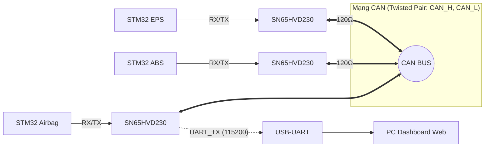
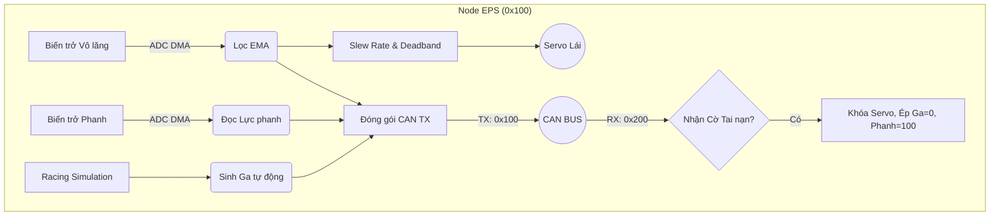
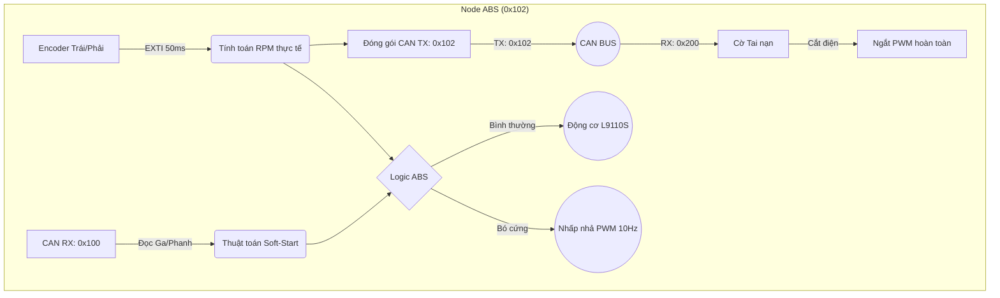
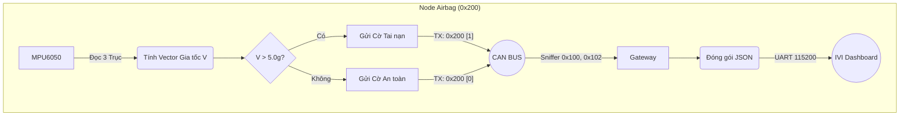
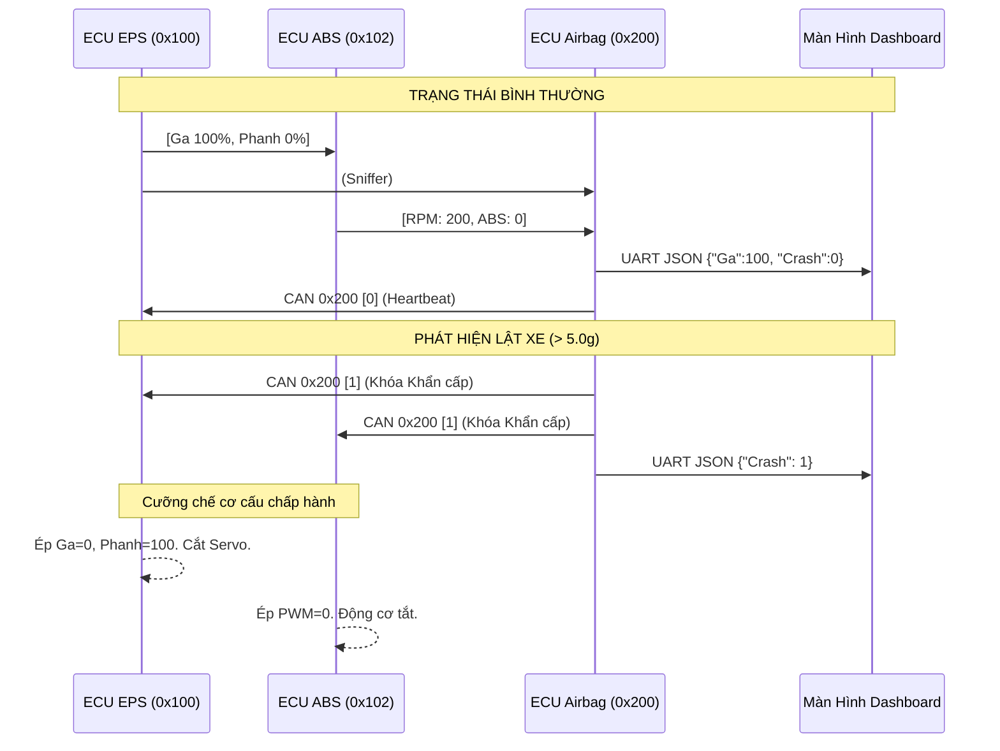

# TÀI LIỆU TỔNG HỢP ĐỒ ÁN — Hệ Thống Mạng CAN 3 Node ECU & IVI Dashboard

---

## Mục lục
1. TỔNG QUAN VỀ HỆ THỐNG
2. CƠ SỞ LÝ THUYẾT
3. THIẾT KẾ VÀ TRIỂN KHAI HỆ THỐNG
4. KIỂM THỬ HỆ THỐNG
5. KẾT LUẬN

---

## 1. TỔNG QUAN VỀ HỆ THỐNG

### 1.1. Giới thiệu tổng quan đề tài
Đồ án thiết kế và mô phỏng một mạng lưới giao tiếp trên ô tô (In-Vehicle Network) thu nhỏ, áp dụng tiêu chuẩn công nghiệp **CAN Bus (Controller Area Network)**. 
Hệ thống bao gồm 3 Node ECU độc lập (EPS, ABS, Airbag) giao tiếp theo thời gian thực và 1 Màn hình giải trí trung tâm (IVI Dashboard) bằng công nghệ Web 3D.

### 1.2. Nhiệm vụ và Yêu cầu đồ án
- Thiết kế phần cứng và nối mạng CAN giữa 3 vi điều khiển STM32.
- Lập trình thuật toán mô phỏng Trợ lực lái (EPS), Phanh (ABS) và Cảnh báo va chạm / Túi khí (Airbag).
- Xây dựng phần mềm Dashboard nhận dữ liệu qua UART và hiển thị đồ họa 3D Telemetry.
- Đảm bảo tính chịu lỗi (Fault Tolerance) của toàn bộ hệ thống ở mức thấp nhất (Cấp độ phần cứng & ngắt).

### 1.3. Thời gian và lộ trình phát triển
- **Phạm vi đồ án:** Trọng tâm vào lập trình firmware (Bare-metal/HAL) và giao thức mạng truyền thông, không đi sâu vào thiết kế cơ khí động lực học.
- **Lộ trình:** Hoàn thiện trong 3 giai đoạn: Lập trình thuật toán cho từng Node độc lập -> Ghép nối mạng CAN và lập trình giao diện HMI -> Debug cấp thấp & Tối ưu khả năng sinh tồn của hệ thống.

---

## 2. CƠ SỞ LÝ THUYẾT

### 2.1. Vi điều khiển STM32F103C8T6
- Nền tảng lõi ARM Cortex-M3 (72MHz).
- Tích hợp sẵn bộ điều khiển bxCAN hỗ trợ CAN 2.0A/B.
- Các ngoại vi sử dụng cốt lõi: DMA, ADC, I2C, UART, TIM (PWM), EXTI.

### 2.2. Giao thức mạng CAN (Controller Area Network)
> **💡 Bản chất cốt lõi của mạng CAN:** 
> 1. **ID định danh cho "Bản tin", không phải cho "Node":** Mạng CAN không có địa chỉ Node. CAN ID (ví dụ `0x100`) chỉ định danh cho nội dung *"Dữ liệu Vô lăng & Phanh"*. 
> 2. **Mạng Phát thanh (Broadcast) & Bộ lọc Phần cứng (Acceptance Filter):** Bất kỳ tín hiệu nào phát ra, toàn bộ đường dây đều "nghe" thấy. Vi điều khiển dùng phần cứng để lọc ID cần thiết, tránh quá tải CPU.

**Cấu trúc Khung truyền (CAN 2.0A Data Frame):**
| Start | ARBITRATION FIELD | CONTROL FIELD | DATA FIELD | CRC FIELD | ACK FIELD | EOF |
| :---: | :---: | :---: | :---: | :---: | :---: | :---: |
| **SOF** (1) | **ID** (11) \| **RTR** (1) | **IDE** (1) \| **r0** (1) \| **DLC** (4) | **Payload** (0-64) | **CRC** (15) \| **DEL** (1) | **ACK** (1) \| **DEL** (1) | **End** (7) |
| `0` | `0x100`/`0x102`/`0x200` \| `0` | `0` \| `0` \| `1`..`8` | Data (Byte 0-N) | *(Tự tính)* \| `1` | `0` (Node nhận đè bit) \| `1` | `1111111` |

### 2.3. Cảm biến gia tốc MPU6050
- Cảm biến IMU 6 trục (Gia tốc kế & Con quay hồi chuyển) giao tiếp qua bus I2C.
- Trích xuất 3 trục X, Y, Z để tổng hợp Vector gia tốc trọng trường $V = \sqrt{A_x^2 + A_y^2 + A_z^2}$.
- Giám sát trạng thái vật lý của xe để kích hoạt hệ thống an toàn thụ động (Airbag / SRS).

### 2.4. Trợ lực lái điện (EPS) và Chống bó cứng phanh (ABS)
- **EPS:** Hệ thống đọc góc lái vô lăng và điều khiển Motor trợ lực. Đồ án mô phỏng bằng động cơ RC Servo và biến trở ADC.
- **ABS:** Hệ thống ngăn bánh xe bị khóa chết khi phanh gấp. Thực thi bằng cách nhấp nhả phanh liên tục (10-15 lần/giây) khi phát hiện tốc độ bánh xe giảm đột ngột dưới mức cho phép.

---

## 3. THIẾT KẾ VÀ TRIỂN KHAI HỆ THỐNG

### 3.1. Thiết kế phần cứng & Giao tiếp vật lý
- **CAN Transceiver:** Sử dụng 3 module **SN65HVD230** (3.3V logic) giao tiếp bus tuyến tính tốc độ 500kbps. 
- **Điện trở đầu cuối:** Mắc 2 điện trở **120Ω** ở 2 đầu mạng để triệt tiêu sóng phản xạ (Signal Reflection).
- **Cơ cấu chấp hành:** Mạch cầu H L9110S (ABS), Servo SG90 (EPS).
- **Sơ đồ mạng tổng quát:**

### 3.2. Triển khai phần mềm và Thuật toán (Application Layer)

**📌 ECU 1: Node EPS (Trợ Lái & Giả Lập Động Cơ)**
- **ADC DMA & Bộ lọc EMA:** Lấy mẫu không nghẽn và lọc nhiễu điện áp cực tốt (`α = 0.15`), tín hiệu điều khiển không bị giật.
- **Hạn chế Cơ khí (Deadband & Slew Rate):** Chống rung Servo (Mù 5µs) và giới hạn đạo hàm (30µs/chu kỳ) để ngăn chặn dòng Inrush gây sụt áp nguồn hệ thống.
- **Racing Simulation:** Tự động mô phỏng chu kỳ đạp ga 30s với hiệu ứng dao động tua máy "Lumpy Idle" y như xe thể thao thực thụ.

**📌 ECU 2: Node ABS (Truyền Động & Phanh)**
- **Đếm Encoder (EXTI):** Lấy mẫu tốc độ vòng quay bánh xe thông qua ngắt cạnh mỗi 50ms.
- **Soft-Start PWM:** Vi phân cấp điện từ từ cho motor `duty += (target - duty) * 0.02f` chống sốc cơ khí.
- **Logic ABS:** Khi lực phanh đạt giới hạn (>30%) và nhận thấy RPM < 100, ECU băm xung 10Hz nhấp nhả motor để chống trượt bánh, giữ lại khả năng kiểm soát hướng đi.

**📌 ECU 3: Node Airbag (Bảo vệ Khẩn cấp & Gateway)**
- Đọc gia tốc MPU6050, khi $V > 5.0g$ sẽ chuyển toàn hệ thống sang chế độ Khẩn cấp (Crash = 1) và hú còi.
- Đóng vai trò **Sniffer Gateway**, hứng toàn bộ ID trên CAN Bus, đóng gói thành JSON truyền về PC qua UART với tốc độ quét 10Hz.

### 3.3. Tổ chức luồng dữ liệu (CAN Data Flow)

**Chi tiết Frame Mạng CAN:**
| Hướng | Node | ID | Chu kỳ | Chi tiết Payload | Mục đích |
| --- | --- | --- | --- | --- | --- |
| **TX** | **EPS** | `0x100` | 50ms | `Byte 0`: Ga, `Byte 1`: Phanh, `Byte 2`: Lái | Báo cáo thao tác lái. |
| **TX** | **ABS** | `0x102` | 50ms | `Byte 0-1`: RPM, `Byte 2`: ABS Flag | Báo cáo tốc độ thực. |
| **TX** | **Airbag** | `0x200` | 100-500ms | `Byte 0`: Cờ Safe (0) / Crash (1) | Heartbeat & Khóa khẩn cấp. |

**Sơ đồ Tuần tự Giao tiếp:**

### 3.4. Xây dựng Giao diện IVI Dashboard
- Xây dựng bằng công nghệ Web (HTML/CSS/JS) kết hợp Three.js.
- Kết nối phần cứng thông qua **Web Serial API** (Chuẩn giao tiếp UART trên trình duyệt).
- Hiển thị theo thời gian thực (Zero-latency): Tốc kế, Vòng tua máy, Vô lăng 3D tương tác và cảnh báo Đỏ toàn bộ buồng lái khi hệ thống Airbag kích hoạt.

---

## 4. KIỂM THỬ HỆ THỐNG

### 4.1. Các Kịch bản Kiểm thử & Vận hành
- **Kịch bản 1 (Mô phỏng Racing):** Hệ thống tự động vù ga lên đỉnh và sang số, màn hình Web hiển thị mượt mà không có độ trễ giật lag.
- **Kịch bản 2 (Test ABS):** Vặn phanh lút cán và dùng tay kìm hãm bánh xe (< 100 RPM). Bánh xe sẽ giật nhấp nhả 10 lần/giây, đồng hồ báo đèn Vàng (ABS).
- **Kịch bản 3 (Crash & Phục hồi):** Lắc mạnh mạch Airbag -> Đèn chớp Đỏ, hệ thống ngắt toàn bộ. Khi bấm Reset mạch Airbag, mạch EPS khôi phục lại kịch bản đua xe từ mốc 0 giây. Động cơ tăng tốc từ từ (Soft-Start) trong 5 giây thay vì vọt ngay lập tức, đây là tính năng bảo vệ sụt áp nguồn (Brown-out) vô giá trị.

### 4.2. Phân tích & Gỡ lỗi Chuyên sâu (Debugging)
Hệ thống đã khắc phục thành công 2 rủi ro phần cứng ở mức kiến trúc vi điều khiển:
1. **Lỗi "Điếc" mạng CAN vĩnh viễn do tràn FIFO (Overrun FOVR0):**
   - Khi CPU bận, FIFO đầy, phần cứng khóa cứng ngắt CAN không nhận thêm tín hiệu.
   - *Khắc phục:* Bơm thủ công macro `__HAL_CAN_CLEAR_FLAG(hcan, CAN_FLAG_FOV0)` vào dòng đầu tiên của hàm ngắt để ép phần cứng tự động phục hồi khỏi bế tắc.
2. **Lỗi MCU treo cứng (Halt) khi bấm Reset lúc mạng đang bận:**
   - Hàm `HAL_CAN_Start()` không đồng bộ được 11-bit rảnh rỗi trên bus nên sinh lỗi, nhảy vào hàm `Error_Handler()` tự sát (Vòng lặp vô tận).
   - *Khắc phục:* Bãi bỏ `Error_Handler()`, viết lại hàm khởi động bằng cơ chế **Retry** `while(HAL_CAN_Start(...) != HAL_OK)` giúp ECU vô cùng lì lợm, chờ đợi đến khi mạng CAN rảnh để chen vào. Tăng đáng kể chỉ số độ tin cậy.

---

## 5. KẾT LUẬN

### 5.1. Kết luận
Đồ án đã xuất sắc mô phỏng lại mạng lưới nhúng phân tán (In-Vehicle Network) trên ô tô với độ tinh xảo về mặt thuật toán rất cao. Hệ thống đáp ứng trọn vẹn 3 tiêu chí công nghiệp cốt lõi: **Xử lý Thời gian thực (Real-time), Khả năng Chịu lỗi (Fault Tolerance), và Cơ chế An toàn thụ động (Airbag/SRS)**. Việc sử dụng Web API kết nối Dashboard cũng mở ra hướng đi HMI hiện đại hóa cho hệ sinh thái xe điện.

### 5.2. Hướng phát triển
- Tích hợp thêm Node BCM (Body Control Module) để quản lý tín hiệu Đèn, Còi, Xi-nhan.
- Ứng dụng RTOS (FreeRTOS) để quản lý đa luồng tác vụ thay vì kiến trúc Bare-metal Super-loop.
- Chuyển đổi giao thức Web Serial sang WebSockets hoặc MQTT qua vi điều khiển ESP32 để hướng đến xe ô tô kết nối Internet (IoT Connected Car).

---
*(Tài liệu này được biên soạn và cấu trúc hóa theo khuôn mẫu chuẩn của Đồ án Tốt nghiệp, dễ dàng sao chép trực tiếp vào báo cáo Word cho Hội đồng bảo vệ).*
