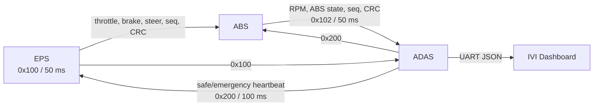
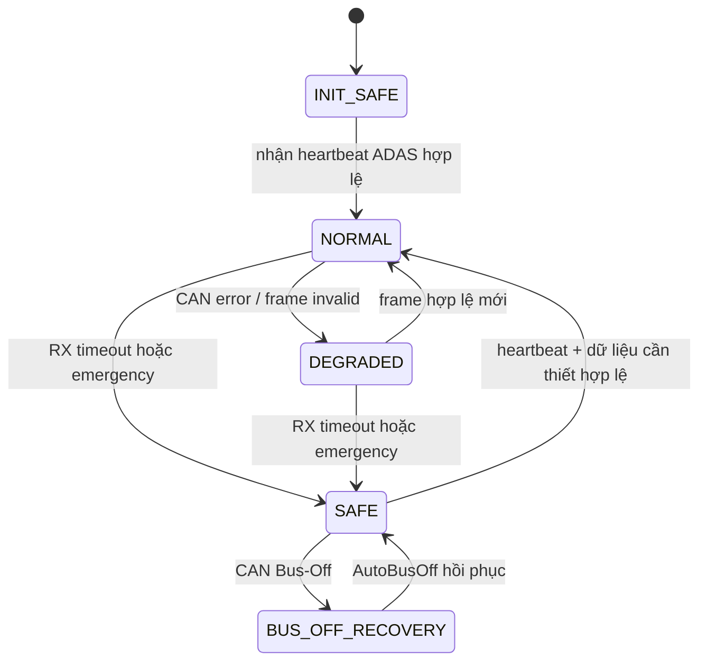

# TÀI LIỆU TỔNG HỢP ĐỒ ÁN V2 — Mạng CAN 3 ECU có CAN Safety

> Phiên bản này mô tả firmware hiện hành trong `EPS/`, `ABS/` và `ADAS/` sau cải tiến an toàn truyền thông CAN. Bản tài liệu và firmware release cũ trong `backup_v1/` được giữ nguyên, không thuộc phạm vi tài liệu V2.

## 1. Tổng quan

Hệ thống gồm ba ECU STM32F103 giao tiếp CAN 2.0A, tốc độ 500 kbps, và ADAS xuất telemetry JSON qua UART cho IVI Dashboard.

| Node | Vai trò cục bộ | TX | RX | Fail-safe khi mất mạng |
| --- | --- | --- | --- | --- |
| EPS | Đọc lái/phanh, servo và tạo lệnh vận hành | `0x100` | `0x200` | Dừng PWM servo, phát ga 0/phanh 100 |
| ABS | Điều khiển 2 motor, ABS, đo RPM | `0x102` | `0x100`, `0x200` | Tắt toàn bộ PWM motor |
| ADAS | Nhận MPU6050, phát hiện crash, gateway IVI | `0x200` | `0x100`, `0x102` | Đánh dấu telemetry EPS/ABS là mất link |



## 2. CAN vật lý và Bus-Off

- CAN 2.0A, Standard ID 11-bit, 500 kbps.
- `Prescaler=4`, `BS1=14TQ`, `BS2=3TQ`, APB1 36 MHz.
- Cả ba ECU bật `AutoBusOff`.
- CAN SCE interrupt và `HAL_CAN_ErrorCallback()` ghi nhận lỗi Error Warning, Error Passive, Last Error Code và Bus-Off.

Khi rút riêng một node dạng nhánh, node còn lại vẫn có thể hoạt động nếu bus chính và hai điện trở kết thúc còn nguyên. Nếu làm đứt bus chính hoặc mất ACK, các node đang phát có thể Bus-Off. CPU không bị treo; CAN tự phục hồi khi đường truyền ổn định. Tuy nhiên actuator chỉ được mở lại sau frame hợp lệ mới, không chỉ dựa vào việc Bus-Off đã hết.

## 3. Protocol V2

### 3.1 Quy tắc chung

- Tất cả frame điều khiển/telemetry có rolling counter 8-bit và CRC-8.
- CRC dùng polynomial `0x1D`, initial value `0xFF`, không final XOR.
- Counter phải tiến về phía trước theo modulo 256. Frame trùng, lùi hoặc cách quá 127 bước bị loại.
- ECU chỉ cập nhật dữ liệu ứng dụng khi đồng thời đúng ID, DLC, phạm vi dữ liệu, CRC và counter.
- Frame lỗi không reset watchdog nhận.

### 3.2 Payload

#### `0x100` — EPS → ABS + ADAS, DLC = 5

| Byte | Tên | Phạm vi | Mô tả |
| --- | --- | --- | --- |
| 0 | `throttle_percent` | 0–100 | Ga |
| 1 | `brake_percent` | 0–100 | Phanh |
| 2 | `steering_can` | 0–255 | Góc lái quy đổi |
| 3 | `counter` | 0–255 | Rolling counter |
| 4 | `crc8` | 0–255 | CRC của byte 0–3 |

Chu kỳ: 50 ms khi active, 500 ms khi idle. Khi EPS đang safe-state: ga = 0, phanh = 100.

#### `0x102` — ABS → ADAS, DLC = 5

| Byte | Tên | Phạm vi | Mô tả |
| --- | --- | --- | --- |
| 0 | `rpm_high` | 0–255 | Byte cao RPM |
| 1 | `rpm_low` | 0–255 | Byte thấp RPM |
| 2 | `abs_active` | 0 hoặc 1 | Trạng thái ABS |
| 3 | `counter` | 0–255 | Rolling counter |
| 4 | `crc8` | 0–255 | CRC của byte 0–3 |

Chu kỳ: 50 ms.

#### `0x200` — ADAS → EPS + ABS, DLC = 3

| Byte | Tên | Giá trị | Mô tả |
| --- | --- | --- | --- |
| 0 | `command` | `0=safe`, `1=emergency` | Lệnh an toàn |
| 1 | `counter` | 0–255 | Rolling counter |
| 2 | `crc8` | 0–255 | CRC của byte 0–1 |

`0x200` là heartbeat bắt buộc, phát mỗi 100 ms trong cả hai trạng thái safe và emergency. Vì vậy, EPS/ABS không coi việc “không nhận emergency” là an toàn; chúng phải nhận heartbeat safe hợp lệ liên tục.

## 4. State machine an toàn



### 4.1 EPS

1. Khởi động với PWM servo bị tắt.
2. Chỉ mở servo sau khi nhận `0x200` safe/emergency hợp lệ và không ở trạng thái emergency.
3. Mất heartbeat ADAS trên 300 ms: dừng PWM servo; bản tin `0x100` chuyển ga 0, phanh 100.
4. Nhận `0x200[1]`: dừng servo ngay; nhận `0x200[0]` hợp lệ giúp rời emergency nếu đường link đang khỏe.

### 4.2 ABS

1. Mất `0x100` EPS trên 200 ms: tắt toàn bộ PWM motor.
2. Mất heartbeat `0x200` ADAS trên 300 ms: tắt toàn bộ PWM motor.
3. Nhận `0x200[1]`: tắt PWM motor ngay.
4. ABS chỉ vận hành lại khi cả lệnh EPS và heartbeat ADAS đều mới, hợp lệ.

### 4.3 ADAS

1. Kiểm tra tính toàn vẹn `0x100` và `0x102` trước khi dùng cho Dashboard.
2. Mất EPS hoặc ABS quá 200 ms: JSON báo `EPS_Link=0` hoặc `ABS_Link=0`; giá trị cũ không được xem là dữ liệu thời gian thực.
3. Crash khi vector gia tốc vượt ngưỡng 5.0g: phát `0x200[1]`, buzzer hoạt động theo logic hiện có.
4. Nút PA0 xóa crash state; heartbeat safe ở main loop phát lệnh recovery, không gửi CAN trong ISR.

## 5. Telemetry và chẩn đoán

ADAS xuất JSON UART định kỳ 100 ms, bao gồm dữ liệu IMU/xe và các trường bổ sung:

```json
{
  "EPS_Link": 1,
  "ABS_Link": 1,
  "CAN_BusOff": 0
}
```

Mỗi ECU giữ các biến chẩn đoán nội bộ: mã lỗi CAN gần nhất, cờ Bus-Off, số frame CRC lỗi và số counter lỗi. Chúng phục vụ debug hoặc có thể được bổ sung vào một frame diagnostic riêng ở Phase tiếp theo.

## 6. Kịch bản kiểm thử bắt buộc

| ID | Thao tác | Kỳ vọng |
| --- | --- | --- |
| TC-01 | Khởi động cả ba ECU | ADAS heartbeat safe xuất hiện; EPS mở servo sau heartbeat; ABS nhận `0x100` hợp lệ |
| TC-02 | Rút CAN tại EPS > 200 ms | ABS tắt PWM; ADAS báo `EPS_Link=0` |
| TC-03 | Rút CAN tại ADAS > 300 ms | EPS dừng servo; ABS tắt PWM |
| TC-04 | Cắm lại CAN | AutoBusOff phục hồi; actuator chỉ hoạt động sau frame V2 hợp lệ mới |
| TC-05 | Chèn frame CRC sai | Không cập nhật ga/phanh/RPM/lệnh; watchdog không được reset |
| TC-06 | Chèn counter lặp/lùi | Frame bị bỏ; bộ đếm lỗi counter tăng |
| TC-07 | Tạo crash > 5.0g | ADAS phát emergency heartbeat; EPS dừng servo; ABS tắt PWM |
| TC-08 | Bấm PA0 sau crash | ADAS trở lại safe heartbeat; hệ thống chỉ hồi khi link và frame đều hợp lệ |

## 7. Quy trình nạp firmware

Protocol V2 thay đổi DLC và payload nên firmware V1 và V2 không tương thích. Cần build và flash đồng thời:

1. `EPS` firmware V2.
2. `ABS` firmware V2.
3. `ADAS` firmware V2.
4. Kiểm tra heartbeat `0x200` trước, sau đó mới kiểm tra `0x100` và `0x102`.

Không flash lẫn một ECU V1 với các ECU V2 khi chạy test chức năng. `backup_v1/` là điểm rollback firmware release cũ.

## 8. Phạm vi và hướng nâng cấp

V2 tạo nền tảng safety communication phù hợp cho đồ án: watchdog, integrity check, fail-safe output, Bus-Off recovery và telemetry link health. Đây chưa phải ISO 26262 production-ready. Các hướng nâng cấp hợp lý:

- Tách định nghĩa ID, DLC, CRC và timeout vào header dùng chung hoặc DBC.
- Thêm diagnostic CAN ID riêng cho lỗi CRC/counter/Bus-Off.
- Lưu DTC vào flash và bổ sung watchdog phần cứng độc lập.
- Phân tích FMEA/FTA, kiểm tra HIL và test nhiễu EMC.
- Dùng transceiver có fault reporting nếu cần chứng minh lỗi lớp vật lý chi tiết hơn.
